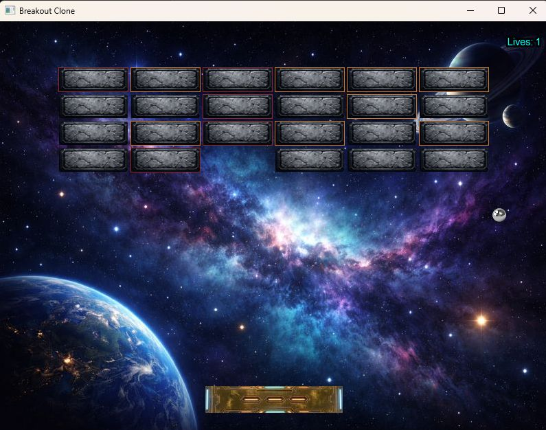

# Breakout Clone (SFML 3, C++)

A simple Breakout clone written in modern C++ using SFML 3.  
Focus is on clean structure, gameplay mechanics, and incremental development.

---

## Screenshot

---

## Features

- Ball movement with consistent speed
- Paddle collision with angle control
- Brick system with strength (multiple hits)
- Collision detection using AABB
- Improved collision handling for multiple brick hits per frame
- Lives system (3 lives)
- Game over state
- Restart functionality
- Pause functionality

---

## Controls

- Left / Right Arrow → Move paddle
- R → Restart game
- P → Pause / Unpause

---

## Technical Details

- C++ (modern style)
- SFML 3.0
- Custom entity system (base `Entity` class)
- Collision handling via bounding boxes (`getGlobalBounds`)
- Direction handling using normalized vectors

---

## Project Structure

- `Entity` → base class for all game objects
- `Ball` → movement + collision response
- `Brick` → destructible objects with strength
- `Paddle` → player-controlled object
- `Background` → static rendering
- `constants.h` → global configuration
- `GameManager` → main game loop and collision handling

---

## Build (Visual Studio 2026 + SFML 3)

Requirements:
- SFML 3 installed
- Visual Studio 2026

Typical setup:

1. Add SFML include directory
2. Add SFML lib directory
3. Link required libraries
4. Copy required SFML DLLs next to your `.exe`

---

## Current State

Core gameplay is working.

Collision handling is stable and supports multiple brick hits per frame.

---

## Planned Improvements

- EntityManager (lifecycle management)
- Sound effects (bounce, brick hit, game over)
- Multiple levels
- Score system
- Visual polish (animations, effects)

---

## Notes

This project is mainly for improving C++ skills and building a solid game architecture step by step.